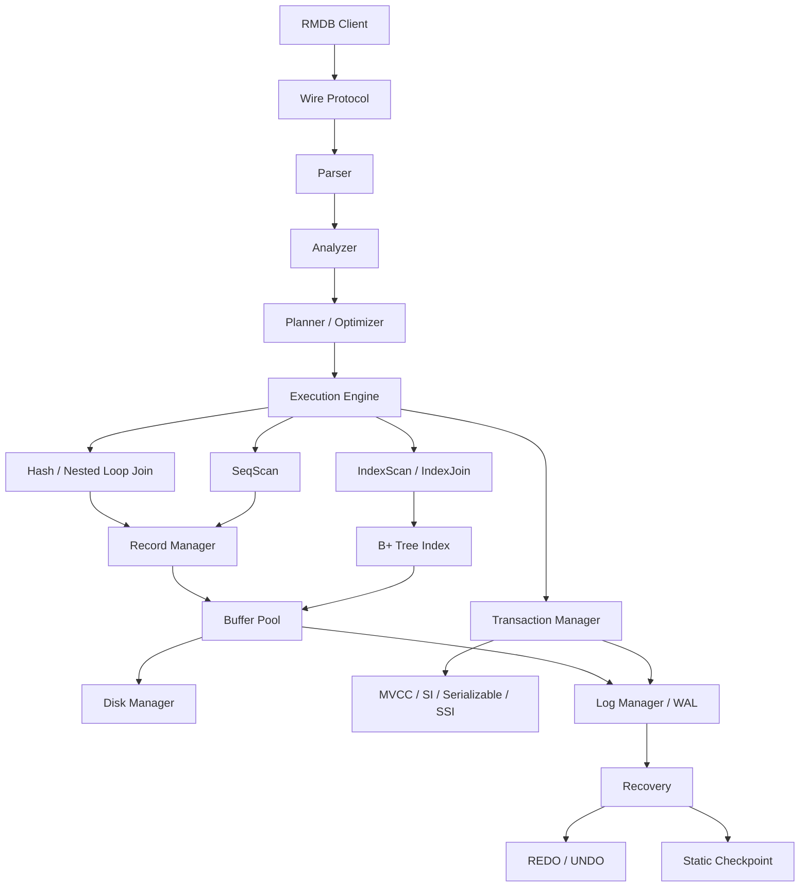

# RMDB 2026 - Database Management System

> 2026 全国大学生计算机系统能力大赛 - 数据库管理系统设计赛参赛项目

本仓库是在中国人民大学数据库教学团队提供的 **RUCBase / RMDB** 教学数据库框架基础上完成的团队项目。项目围绕关系型数据库内核进行功能扩展与工程化优化，覆盖 SQL 前端、查询执行、存储与索引、事务与并发控制、WAL 与故障恢复等模块。

## 系统架构



更详细的模块说明见 [`docs/ARCHITECTURE.md`](docs/ARCHITECTURE.md)。

## 目录结构

```text
RMDB-2026-CSCC/
├── src/
│   ├── analyze/       # 语义分析
│   ├── execution/     # 执行器
│   ├── index/         # B+ Tree 索引
│   ├── optimizer/     # Planner / Optimizer
│   ├── parser/        # Flex / Bison SQL 解析
│   ├── record/        # Record Manager
│   ├── recovery/      # WAL / REDO / UNDO / Checkpoint
│   ├── storage/       # Buffer Pool / Disk Manager
│   ├── system/        # Catalog / System Manager
│   └── transaction/   # MVCC / SI / Serializable / SSI
├── rmdb_client/       # 命令行客户端
├── deps/              # 第三方依赖（GoogleTest）
├── docs/
│   ├── ARCHITECTURE.md
│   ├── PERFORMANCE.md
│   └── RMDB-Technical-Report.md
├── CMakeLists.txt
├── LICENSE
└── NOTICE.md
```

## 环境要求

推荐环境：

- Linux（Ubuntu 22.04 / 24.04 均可）
- GCC / G++（服务端使用 C++17；独立客户端使用 C++20）
- CMake >= 3.16
- Flex（可选；用于重新生成词法分析器）
- Bison（可选；用于重新生成语法分析器）
- GNU Readline 开发库
- pthread

Ubuntu / Debian 可安装：

```bash
sudo apt update
sudo apt install -y build-essential cmake libreadline-dev flex bison
```

## 编译服务端

```bash
git clone https://github.com/xmj535/RMDB-2026-CSCC.git
cd RMDB-2026-CSCC

cmake -S . -B build
cmake --build build -j"$(nproc)"
```

服务端可执行文件默认位于：

```text
build/bin/rmdb
```

## 编译客户端

客户端为独立 CMake 工程：

```bash
cmake -S rmdb_client -B build-client
cmake --build build-client -j"$(nproc)"
```

客户端可执行文件通常位于：

```text
build-client/rmdb_client
```

## 运行

启动服务端并指定数据库目录名称：

```bash
./build/bin/rmdb demo_db
```

默认监听 TCP `8765` 端口。另开终端启动客户端：

```bash
./build-client/rmdb_client -h 127.0.0.1 -p 8765
```

> 安全提示：服务端当前不提供身份认证或 TLS，并可能监听所有网络接口；`LOAD` 会读取服务端可访问的文件路径。请仅在受信主机或隔离网络中运行，不要直接暴露到公网。

随后可以执行 SQL，例如：

```sql
create table student(id int, score float);
insert into student values(1, 95.5);
select * from student;

set transaction isolation level snapshot isolation;
set transaction isolation level serializable;

explain analyze select * from student where id = 1;
create static_checkpoint;
```

## 测试

顶层 CTest 当前注册 Parser 测试；存储与记录管理相关的 6 个单元测试由 `unit_test` 程序提供，需要单独运行：

```bash
ctest --test-dir build --output-on-failure
./build/bin/unit_test
```

部分性能与数据一致性验证需要配套数据集或特定测试环境，因此不保证仅凭本公开仓库可以复现比赛环境中的全部测评过程。

## 性能优化说明

主要优化方向包括：

- 在符合隔离语义的场景使用 IndexScan，减少不必要的全表扫描；
- 根据连接规模选择不同 Join 路径，避免大表上的朴素嵌套循环退化；
- 复用索引扫描中的叶子页 pin，降低频繁 fetch / unpin 的开销；
- 控制事务、MVCC 版本和 SSI 读集的长期内存增长；
- 使用流式日志扫描进行恢复，降低大日志恢复时的峰值内存；
- 在脏页刷盘前确保日志满足 WAL 持久化约束；
- 通过静态检查点缩短恢复需要扫描的日志范围。

详见 [`docs/PERFORMANCE.md`](docs/PERFORMANCE.md) 和 [`docs/RMDB-Technical-Report.md`](docs/RMDB-Technical-Report.md)。

## 技术文档

比赛期间整理的系统设计与实现文档已保留为公开版技术资料：

- [RMDB 数据库系统设计与技术实现文档](docs/RMDB-Technical-Report.md)

该报告描述公开仓库中的实现，若文档与当前源码存在差异，以仓库源码为准。

## 上游项目与许可证

本项目基于中国人民大学数据库教学团队的 **RUCBase / RMDB** 教学框架开发：

- Upstream: `ruc-deke/rucbase-lab`
- License: **Mulan Permissive Software License v2 (Mulan PSL v2)**

本仓库保留了上游源文件中的版权与许可证声明，根目录 [`LICENSE`](LICENSE) 为 Mulan PSL v2 全文。第三方代码继续遵循其各自许可证，例如 `deps/googletest/LICENSE`。

更多归属说明见 [`NOTICE.md`](NOTICE.md)。

## 致谢

感谢 RUCBase / RMDB 教学数据库框架的开发者、赛事技术委员会以及团队成员在项目开发、测试和答辩过程中的协作。
