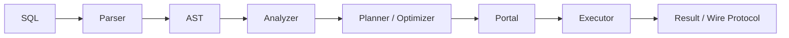
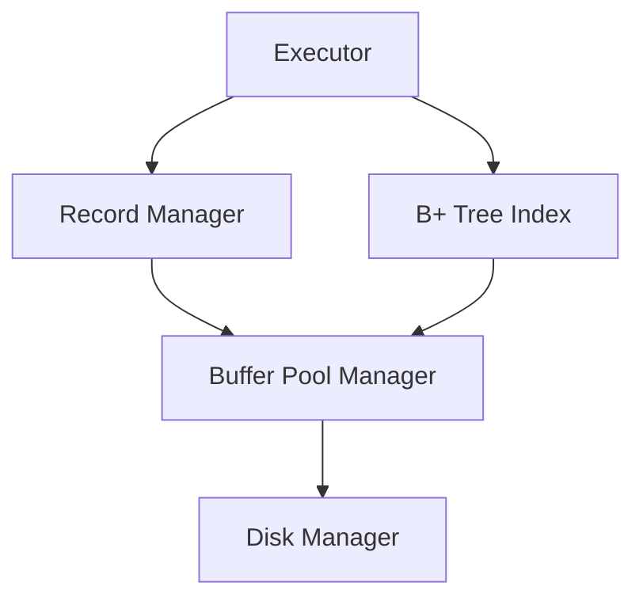

# RMDB Architecture

本文档对公开仓库中的主要模块和执行路径做简要说明。更完整的设计说明见 `RMDB-Technical-Report.pdf`。

## 1. SQL 请求处理链路



主要目录：

- `src/parser/`：Flex / Bison 词法与语法解析；
- `src/analyze/`：语义分析与列、表等信息绑定；
- `src/optimizer/`：逻辑 / 物理计划组织与扫描、连接路径选择；
- `src/execution/`：具体执行器与结果输出。

## 2. 存储层



- `src/record/` 管理记录页、空闲槽位与扫描；
- `src/index/` 提供 B+ Tree 索引维护与范围扫描；
- `src/storage/` 管理页缓存、磁盘文件和日志文件 I/O；
- Buffer Pool 在刷写脏页前通过日志回调满足 WAL 顺序约束。

## 3. 查询执行

执行器包括：

- Sequential Scan；
- Index Scan；
- Projection / Filter；
- Insert / Delete / Update；
- Nested Loop Join；
- Hash Join；
- Index Join；
- Sort / Aggregate / Limit / Union；
- `EXPLAIN ANALYZE` 相关执行与统计。

Planner 会依据隔离级别、索引条件与估计工作量选择不同扫描或连接策略。Serializable 模式需要兼顾 SSI 读依赖语义，因此扫描路径选择不仅是纯性能问题。

## 4. 事务、MVCC 与 SSI

`src/transaction/` 维护事务状态、版本链、时间戳和 watermark。

支持两种主要隔离模式：

- **Snapshot Isolation**：事务读取固定快照，并根据版本可见性返回记录；
- **Serializable**：在 MVCC 基础上记录读 / 写关系和谓词信息，用于检测可能破坏可串行化的反依赖结构。

版本相关状态需要与堆记录、事务生命周期和垃圾回收保持一致，避免陈旧版本长期占用内存。

## 5. WAL 与恢复

恢复模块位于 `src/recovery/`。

核心流程：

1. 数据修改生成 WAL；
2. 数据页落盘前确保相关 WAL 已持久化；
3. 重启后分析日志；
4. REDO 已提交操作；
5. UNDO 未提交事务的物理影响；
6. 根据静态检查点缩短需要扫描的日志范围。

项目使用流式方式处理恢复日志，避免在大日志场景一次性将全部恢复状态载入内存。

## 6. Client / Server

服务端入口为 `src/rmdb.cpp`，默认监听 TCP 8765 端口。

客户端位于 `rmdb_client/`，通过自定义 wire protocol 与服务端交互：

```bash
./build/bin/rmdb demo_db
./build-client/rmdb_client -h 127.0.0.1 -p 8765
```

## 7. 设计原则

公开版代码整理遵循以下原则：

- 不改变比赛最终版本的核心数据库语义；
- 将测试点导向的注释改写为可维护的工程解释；
- 保留上游版权 / 许可证信息；
- 将比赛交付材料与个人信息从代码仓库中剥离；
- 将性能优化理由尽可能表述为数据库语义、算法复杂度和资源约束，而不是特定评分用例。
